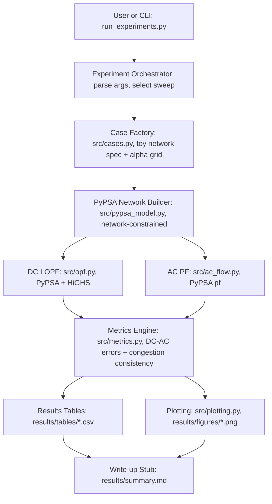
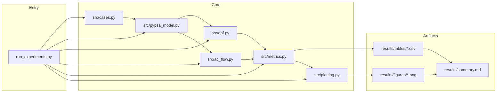

# Demo3 v0.1 -- Development Architecture (PyPSA DC LOPF vs AC PF)

This document summarizes the runtime dataflow, module dependencies, and module boundaries for
Demo3 v0.1, aligned to the PRD objective: DC vs AC agreement across a controlled stress sweep.

---

## 1) Runtime Dataflow

---

## 2) Module Dependency View

---

## 3) Module Boundaries (v0.1)

- `src/cases.py`
  - Defines the toy network spec and alpha sweep grid.
  - Outputs: structured inputs for buses/lines/gens/loads and scenario parameters.

- `src/pypsa_model.py`
  - Builds a PyPSA `Network` with buses/lines/generators/loads and snapshots.
  - Encodes the network-constrained topology used for DC vs AC comparison.

- `src/opf.py`
  - Runs PyPSA LOPF using HiGHS by default (configurable to gurobi).
  - Outputs: solved network with dispatch, flows, and shadow prices.

- `src/ac_flow.py`
  - Runs PyPSA AC power flow (`Network.pf`) on the network-constrained case.
  - Outputs: line flows, voltage angles/magnitudes, convergence flag.

- `src/metrics.py`
  - Computes DC-AC flow errors and congestion consistency.
  - Outputs: tidy metrics rows and `results/tables/*.csv`.

- `src/plotting.py`
  - Generates plots from the metrics table (DC-AC error, congestion).

- Artifacts
  - `results/tables/*.csv` -- per-alpha metrics table(s)
  - `results/figures/*.png` -- comparison plots
  - `results/summary.md` -- short write-up with headline findings and caveats

- Optional legacy baseline
  - `src/dc_flow.py` may remain as a non-primary reference, but must not be the main solver.
