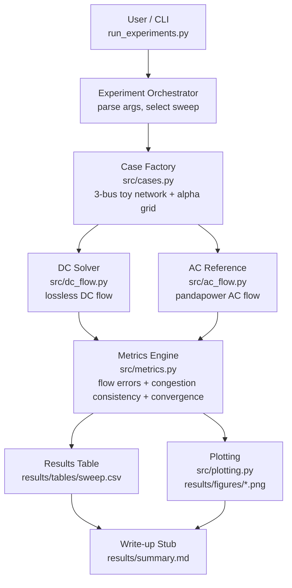
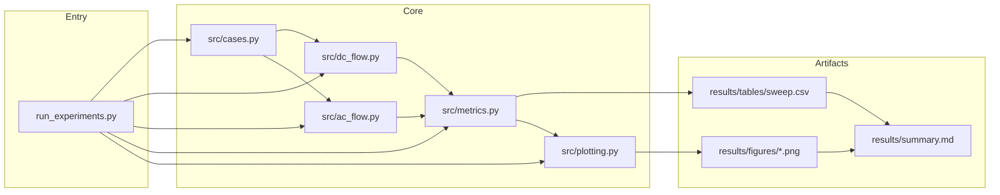

# Demo3 v0.1 — Development Architecture (Aligned with Tech Design)

This document summarizes the **runtime dataflow**, **module dependencies**, and **module boundaries** for Demo3 v0.1, aligned to the toy GB-inspired DC vs AC agreement study.

---

## 1) Runtime Dataflow

---

## 2) Module Dependency View

---

## 3) Module Boundaries (v0.1)

- **`src/cases.py`**
  - Defines the 3-bus toy network and alpha sweep grid.
  - Outputs: buses/branches, injections (P), and case labels/parameters.

- **`src/dc_flow.py`**
  - Computes lossless DC flows for each case.
  - Outputs: per-branch active power flows, optional angles, feasibility flags.

- **`src/ac_flow.py`**
  - AC reference solver using pandapower.
  - Outputs: per-branch active power flows, optional voltage magnitudes/angles, convergence flag.

- **`src/metrics.py`**
  - Computes flow errors and congestion indicator consistency across the sweep.
  - Outputs: structured metrics and row-wise records for `results/tables/sweep.csv`.

- **`src/plotting.py`**
  - Generates plots from the tidy metrics table (e.g., error vs alpha, loading vs alpha).

- **Artifacts**
  - `results/tables/sweep.csv` — per-alpha metrics table
  - `results/figures/abs_error_vs_alpha.png`
  - `results/figures/loading_vs_alpha.png`
  - `results/summary.md` — short write-up stub with headline findings and caveats
