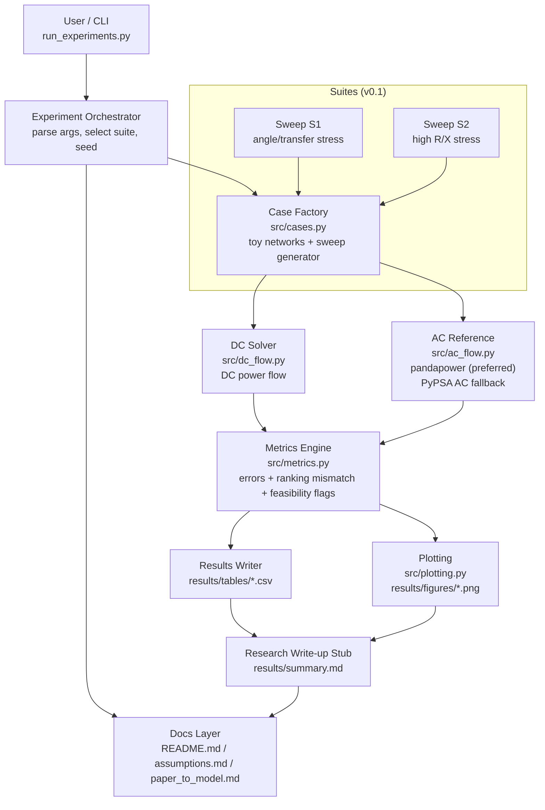
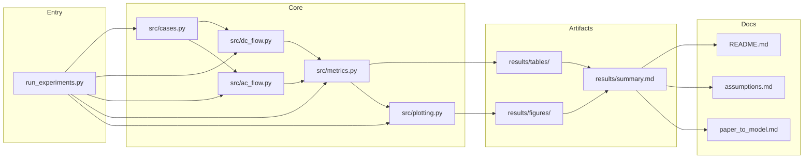

# Demo3 v0.1 — Development Architecture (Integrated)

This document consolidates the **runtime dataflow**, **module dependency view**, and **module boundary notes** for Demo3 v0.1.

---

## 1) Runtime Dataflow Architecture

---

## 2) Code Module Dependency Architecture

---

## 3) Module Boundaries (v0.1)

- **`src/cases.py`**
  - Generates *networks + operating conditions* for baseline cases and sweeps.
  - Outputs: buses/branches metadata, injections (P), and any case labels/parameters.

- **`src/dc_flow.py`**
  - Given a case/network + injections, computes DC power flow results.
  - Outputs: per-branch active power flows, nodal angles (if applicable), feasibility flags.

- **`src/ac_flow.py`**
  - AC reference solver (prefer pandapower; fallback acceptable).
  - Outputs: per-branch active power flows (and optionally voltage magnitudes/angles), feasibility flags.

- **`src/metrics.py`**
  - Compares DC vs AC outputs and produces decision-relevant metrics:
    - flow error norms
    - congestion / ranking mismatches
    - feasibility mismatch flags
  - Outputs: a structured metrics object + row-wise records for CSV.

- **`src/plotting.py`**
  - Converts tables/metrics into figures (PNG) without touching solver logic.

- **Artifacts**
  - `results/tables/*.csv` — metrics tables per suite/case
  - `results/figures/*.png` — visualizations per suite/case
  - `results/summary.md` — short write-up stub: what was tested + headline findings

---

## Suggested Filename Convention

- This doc: `Demo3_v0.1_Dev_Architecture.md`
- Optional: keep diagrams in a dedicated `docs/` folder if you prefer.
